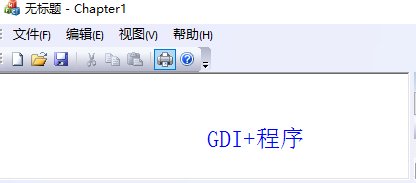

## 初识GDI+

​	GDI+是微软 XP、Server2003 操作系统的图形引擎，GDI+是一个应用编程接口，通过一组C++类来提供接口的功能。是早期windows版本GDI的继任者。

## 建立GDI+程序

​	搭建一个GDI+程序只需要4个步骤:

1.在项目中引入 GDI+的头文件，使用GDI+的命名空间

2.初始化 GDI+系统资源

3.是完毕之后，释放GDI+所使用的资源

4.在编译时加入GDIPlus.lib库文件

以下使用MFC框架进行搭建:

   1.Visual Studio 2019新建项目------->C++ MFC 框架程序------>基于单文档--------->完成

   2.在应用程序主头文件中 引入GDI+头文件：

​		#include <gdiplus.h>

​		using namespace Gdiplus;

   3.主cpp文件 中 初始化 和销毁 GDI+系统资源：

		//一个GDI+引用的全局变量
		ULONG_PTR gdiplusToken;
		
		BOOL CMFCApp::InitInstance()
		{
			//coding......
			//GDI+系统资源初始化
			GdiplusStartupInput gdiplusStartupInput;
			::GdiplusStartup(&gdiplusToken, &gdiplusStartupInput, NULL);
			CWinAppEx::InitInstance();
			//coding...
			return TRUE;
		}
		
		int CMFCApp::ExitInstance()
		{
			//销毁GDI+
			::GdiplusShutdown(gdiplusToken);
		
			AfxOleTerm(FALSE);
	
			return CWinAppEx::ExitInstance();
		}

​		4.添加GDI+ Lib库文件到项目中（前面的步骤只能编译，不能正确的链接LINK）

​			右键 解决方案下的 工程文件----->添加------>现有项-------->在VS安装目录下找到 gdiplus.lib(C:\Program Files (x86)\Windows Kits\10\Lib\10.0.19041.0\um\x86)根据不同的 VS版本可能路径会发生一些改变。

​		5.展示简单的GDI+示例程序

	void CMFCAppView::OnDraw(CDC* /*pDC*/)
	{
		CChapter1Doc* pDoc = GetDocument();
		ASSERT_VALID(pDoc);
		if (!pDoc)
			return;
	    // TODO: 在此处为本机数据添加绘制代码
	
	    //建立 图形对象
	    Gdiplus::Graphics graphics(this->GetDC()->m_hDC);
	    //设定文本输出使用的 画笔、色彩、字体
	    Pen pen(Color(255, 0, 0, 0));
	    SolidBrush brush(Color(255, 0, 0, 255));
	    Gdiplus::FontFamily ff(L"宋体");
	    Gdiplus::Font font(&ff, 24, FontStyleRegular, UnitPixel);
	    CRect rect;
	    this->GetClientRect(&rect);
	    PointF pointF(rect.right / 2, rect.bottom / 2);
	    graphics.DrawString(L"GDI+程序", -1, &font, pointF, &brush);
	}
运行效果:

