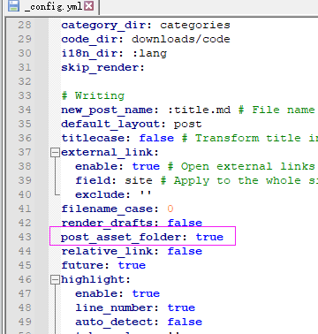

使用Hexo发布的博客如果想要显示图片需要配置以下几个地方：

安装 Hexo 依赖包：npm install hexo-asset-image --save

使用命令hexo new ”博客名字“ 

生成新的MD文件 会自动生成一个与 ”博客名字“相同的目录，这个目录用于存放你的图片资源 使用相对路径引用里面图片，如果是为已有的博客添加图片类资源只需要在 source\\_posts\ 路径下新建一个相同名字的文件夹即可
