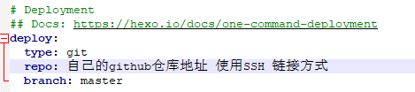

# 1.准备工作

下载[NodeJs](https://nodejs.org/en/download/ )👈点击访问官网

下载[Git](https://git-scm.com/ )👈点击访问官网

注册[Github](https://github.com/signup?source=login)👈点击访问官网

# 2.安装

#### NodeJs:

1. 双击NodeJS安装程序 向导部分使用默认选项安装即可(Next按钮到底) 安装完成 使用命令行工具 

   使用 node -v 验证安装。

   使用 npm -v 验证安装。

2. 如果希望自定义NodeJs下载的 全局模块和缓存 文件夹的存放路径， 

   那么需要 在 **盘符:\目录...**  2个空文件夹 ，

   使用 npm config set prefix ”盘符:\目录...\node_global“ 指定全局模块下载路径，

   使用 npm config set cache ”盘符:\目录...\node_cache“ 指定缓存下载路径。

   右击 计算机----->属性----->环境变量---->在用户变量中点击新建----->变量名输入NODE_PATH,

   变量值输入盘符:\目录...\node_global\node_modules.----->在系统变量下的Path变量的变量值中增加 盘符:\目录...\node_global 一条路径。

   经过上面的步骤，NodeJs下载的模块会下载到我们自定义的盘符目录中，使用 npm install express -g 验证。（-g 是全局安装的意思，不加 -g 会默认下载到当前目录）。如果执行出错

   检查是否应用了 计算机的 PowerShell脚本设置,在电脑设置---->开发者选项----->PowerShell

   检查文件夹权限 将所有权限 允许即可。

   ---------->如出现 无响应的情况 执行 第3步 设置完毕后再执行上面的验证

   --------->如果不需要略过此项

3. 使用 npm下载时 是从国外服务器下载，国内会很慢，一般会指向淘宝https://registry.npm.taobao.org。

   查看npm源 使用 npm config get registry  如果是https://registry.npmjs.org/ 说明是外国源

   更换位淘宝源 使用 npm config set registry https://registry.npm.taobao.org 使用上面命令查看配置是否成功。

   由于npm的服务器在海外，访问速度慢，不稳定，cnpm的服务器是由淘宝团队提供，在国内cnpm是npm镜像，一般会同步更新，相差10分钟左右，所以cnpm在安装一些软件时会快很多，cnpm只适用于安装，项目创建和卸载相关操作还是使用 npm命令。

   npm install -g cnpm --registry=https://registry.npm.taobao.org 操作完之后能在node_gloal\node——modules目录下看到cnpm模块

   使用 cnpm -v 可查看

   ----------->如果有科学上网工具可以略过此项

#### Git:

1. 双击Git安装程序，向导部分使用默认选项安装即可(Next按钮到底) 安装完成 使用命令行工具 

   git -v 验证安装。

2. 在桌面右击--->选择Git bash here

   使用git命令配置个人信息

   git config --global user.name "自己在Github上注册的用户名"

   git config --global user.email "自己在Github时注册的邮箱"

   配置完成 生成 SSH Keys

   使用命令: ssh-keygen - t rsa -C "Github时注册的邮箱"

   回车后会在C:\Users\Administrator\.ssh目录中生成一个 id_rsa.pub的文件

   

#### GitHub:

1. 登录GitHub

2. 点击最右侧的头像---->Settings---->SSH and GPG keys---->New SSH key

   将C:\Users\Administrator\.ssh\id_rsa.pub用记事本打开复制里面的内容粘贴到

   Key框中。

   Title随意。

    点击Add SSH key

3. 点击 + 号 选择 New repository --->Repository name 部分 

   填写格式 用户名.github.(com 或者 git)。其它默认即可。

   在浏览器中输入:用户名.github.io 能正常访问 表示配置成功。

   

# 3.关联Hexo & Github

1. 在某个盘符新建一个文件夹

2. 使用命令行工具指向该路径

3. 使用 npm 或者 cnpm 安装 Hexo框架 

   命令:npm install -g hexo-cli

   命令:cnpm install hexo --save

   初始化  hexo 

   使用命令: hexo init

   生成静态文件

   使用命令:hexo g

   打开本调试服务器

   使用命令:hexo s

   在浏览器中输入 localhost:4000即可看到hexo框架默认展示

4. 部署到github远端服务器

   使用命令:npm install hexo-deployer-git --save

   下载关联插件

   打开博客目录---->_config.yml使用记事本打开修改deploy部分：

   使用命令:hexo d 推送到github仓库

5. 使用浏览器访问:用户名.github.io 
