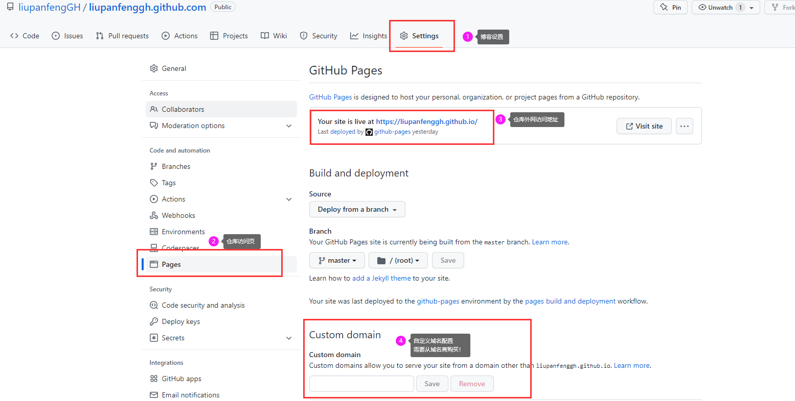

### 域名准备

------

​	个人使用的是阿里云的[万网](https://wanwang.aliyun.com/?spm=5176.19720258.J_2686872250.5.61bd76f44C2cpq&scm=20140722.M_5933523.P_197.MO_401-ID_5933523-MID_5933523-CID_715-ST_3903-V_1)域名注册，还有其它的域名注册商可以自行去[知乎](https://www.zhihu.com/)了解。域名购买到使用由于国内有实名认证的限制，需要审核通过才能购买一般工作日1-3天审核反馈。个人使用一般买便宜和续费也相对便宜的。

### 域名解析配置(万网)

------

​	进入域名控制台如下图设置即可，相关填写参数含义需要配合说明查看。

### Github设置

------

​	进入自己的博客仓库如下图序号设置：

## 一次配置

上面的方法有个很大的弊端，如果每次修改或者添加新的内容，上面都需要重新配置一遍，很麻烦。

故使用一次配置的方案才是关键。

1.在自己的博客仓库（本地Hexo框架）主页（source目录）下 新增一个 CNAME 的文件 无后缀（txt即可）。

2.把之前购买的域名写入文件中。

3.使用Git命令提交到Github仓库，不出意外 博客仓库的Settings-->Pages页面会自动匹配上你填写到CNAME文件中的域名。 

### 预览

------

​	配置完相关设置，即可在浏览器中输入预览了。

