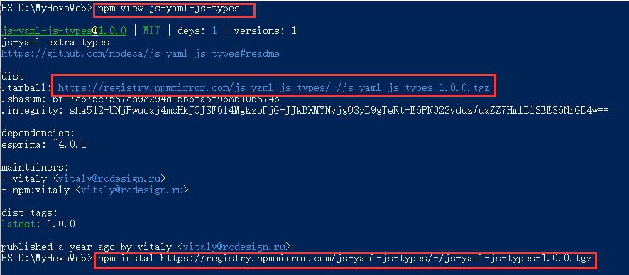

### 另一台设备

​		设备已经安装完毕 NodeJS 与 Git 工具包，这里不再赘述，如有需要请转到 [使用Hexo-Github-搭建个人博客](https://liupanfenggh.github.io/2022/11/13/%E4%BD%BF%E7%94%A8Hexo-Github-%E6%90%AD%E5%BB%BA%E4%B8%AA%E4%BA%BA%E5%8D%9A%E5%AE%A2/)安装部分查看。

------

1. 使用Git Bash Here 克隆 GitHub 远端仓库的个人博客地址

   使用命令:Git Clone  自己的博客仓库地址

2. 克隆完成之后使用 命令行工具进入此目录

   使用命令:npm 或 cnpm install -g hexo-cli 回车

   使用命令:npm 或 cnpm install hexo --save 回车

3. 安装完成 hexo 框架，使用命令 hexo g 生成博客文件 

   **如果 files 出现 0 的情况代表出现了问题。**

   1.主题包(themes)问题 

   ​		解决此类问题，只需要到对应的 插件包地址 重新安装即可（比如我使用了 icarus 的主题插件包 ，只需要到 https://github.com/ppoffice/hexo-theme-icarus 根据 说明 重新安装即可。）

   

   2.插件包(node_modules)问题

   ​		这类问题一般是在安装插件包的时候出现：

   ​		

   ​		解决此类问题，使用命令:npm view 插件包名，然后可以看到 插件包目前的包信息，复制安装包信息的URL，使用命令：npm install URL地址 安装即可。如下图所示：

   

   ​			还有一种解决方式：打开浏览器输入 https://www.npmjs.com/ 再网站搜索栏搜索这个 安装包。如果没有找到安装包的信息，看看控制台是否有 dependency 的 信息 如果有 直接使用npm命令安装 dependency of ‘xxxx’ 包 即可。（npm install xxxx)

   

   3.md文件是否丢失，检查\\\source\\_posts路径下的文件

4. 预览时发现博客中的图片丢失.

   解决此类方法使用相对路径即可。( /xx.png )

